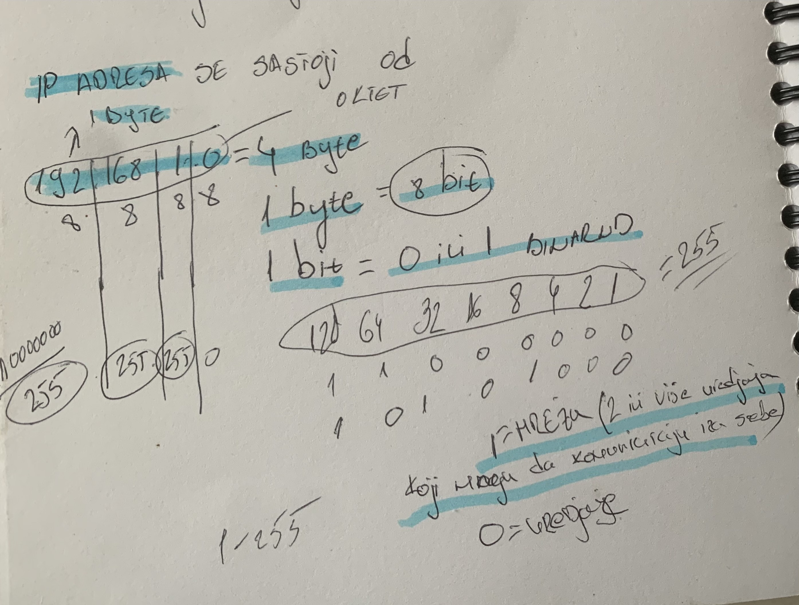
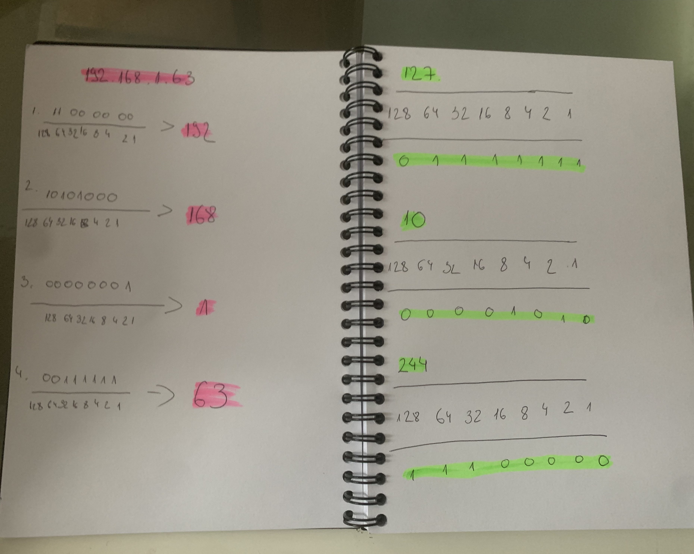
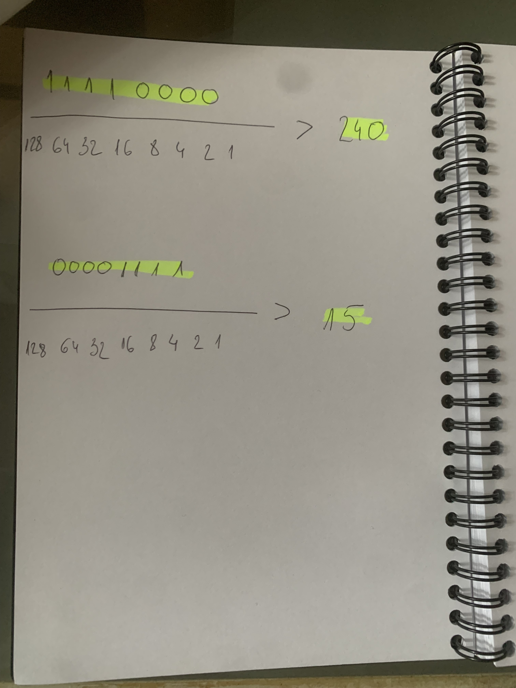

<<<<<<< HEAD
  Network-Logic-Studies

Documentation of binary conversion,IP addressing,and network foundations.
Contents:
Visual Guides:Hand-drawn schematics for binary-to-decimal conversion.
Exercises:Practical application of 8-bit octets and network headers.
Fokus:Deep dive into how data is structured at the bit level

=======
 ## Komande za Kali Linux
1.Sudo apt update-Osvezavas listu dostupnih paketa
2.Sudo apt upgrade-Instaliras nove verzije
3.mkdir-pravis novu fasciklu
4.cd-ulazis ili izlazis iz fascikle
5.ls-izlistas sve sto je unutra
6.touch-pravis prazan fajl 
7.pwd-gde se tacno nalazis
8.rm-r  -brises ceo folder
9.cat-ispisujes ceo sadrzaj fajla u terminalu
10.head-pokazuje prvih 10 linija fronta
11.tail-pokazuje 10 poslednjih linija fronta
12.less-otvara fajl za pregled
13.nano-jednostavan tekstualni editor direktno u terminalu
14.top ili htop-prikazuje procese koji su trenutno pokrenuti i zauzece memorije
15.sudo adduser-dodajes novog usera
16.sudo su-ROOT(najmocniji user u sistemu)
17.deluser-brisanje usera(samo ROOT moze to da uradi)(kad si na ROOT ne treba SUDO)
18.tmp-trenutni fajlovi
19.man-objasnjenja za sve komande 
20.vim-menjanje teksta u fajlu 
21.mv-za promenu imena fajla
22.whereis-trazis instalirani paket
23.whoami-sve o tebi 
>>>>>>> 69aea9dd95f1c52e2157e7e1d45a80a475e9f941
